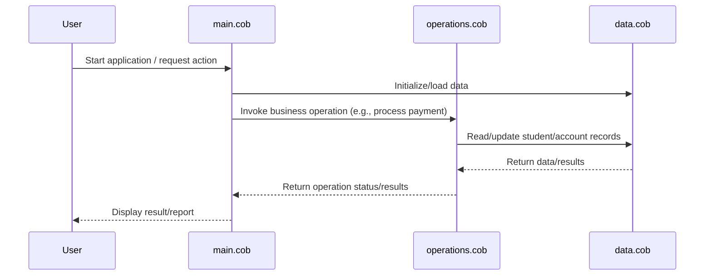

# Sequence Diagram: Data Flow

## School Accounting System - COBOL Legacy Code Documentation

## Overview

This project is a legacy COBOL-based accounting system designed for school financial management. The system is organized into modular COBOL files, each serving a specific role in the application.

## File Structure

- **src/cobol/data.cob**
  - Contains data definitions, record layouts, and variable declarations.
  - Defines the structure for student records, account balances, and transaction data.

- **src/cobol/main.cob**
  - Serves as the main entry point for the accounting system.
  - Handles system initialization, user interaction, and orchestrates the overall program flow.
  - Calls business logic and operations modules as needed.

- **src/cobol/operations.cob**
  - Implements the core business logic and accounting operations.
  - Handles tasks such as processing payments, updating account balances, and generating financial reports.
  - Contains procedures for transaction management and data updates.

## Key Functions

- **Data Management**: The system defines and manages student and account data, ensuring accurate record-keeping.
- **Transaction Processing**: Supports payment processing, account updates, and transaction logging.
- **Reporting**: Generates financial reports for school administration, summarizing account statuses and transactions.

## Business Requirements

- Maintain accurate records of student accounts and transactions.
- Support payment processing and account balance updates.
- Provide reporting capabilities for financial oversight.
- Ensure data integrity and modular code organization for maintainability.

---

This documentation summarizes the structure and purpose of the legacy COBOL codebase, highlighting its modular design and alignment with core school accounting requirements.
